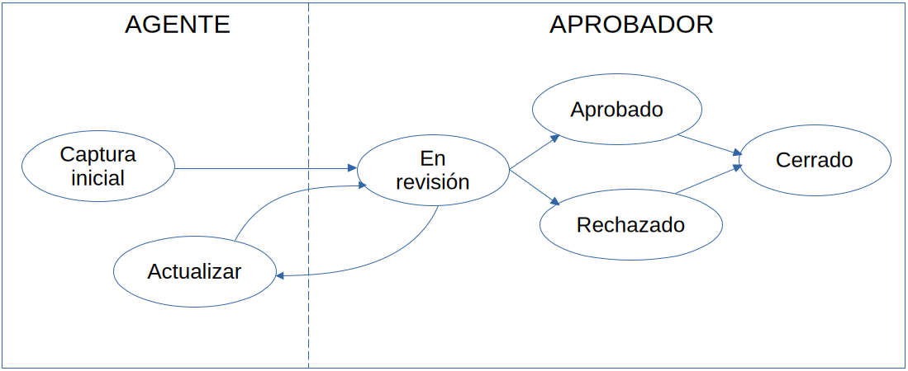

### 1. Descripción del sistema
La finalidad del sistema es proporcionar una interfaz funcional para el envío de las solicitudes de préstamo. Por medio de esta página web, los agentes podrán capturar los datos del cliente, del aval y los datos del préstamo solicitado, así como el envío de documentos digitalizados y su almacenamiento.

### 1. Flujo

El flujo del sistema se muestra en el siguiente diagrama:

_Flujo general de las solicitudes de préstamo._

El agente iniciará el flujo con la captura inicial del préstamo, mismo que será enviado a revisión por parte del aprobador.

El aprobador revisará que los datos y documentos proporcionados sean válidos; si es necesario, redirigirá la solicitud al agente para correcciones, el agente podrá hacer los ajustes necesarios y regresará la solicitud al aprobador para una nueva revisión.

El aprobador podrá aprobar o rechazar una solicitud. Cualquiera de estas dos acciones cerrarán la solicitud, y no podrá ser re-abierta.

### 3. Casos especiales

En cao de que un agente ya no forme parte de la organización, el aprobador podrá cerrar las solicitudes del agente ausente por medio de la acción "Rechazar solicitud".