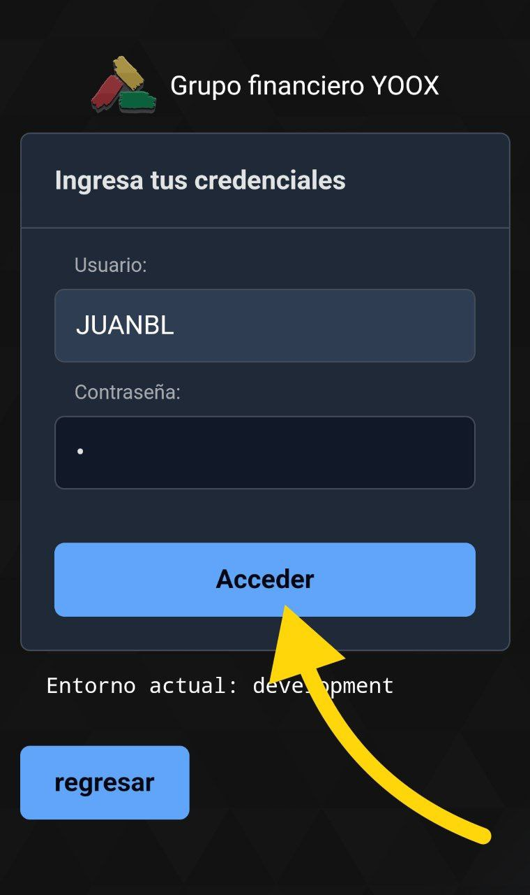
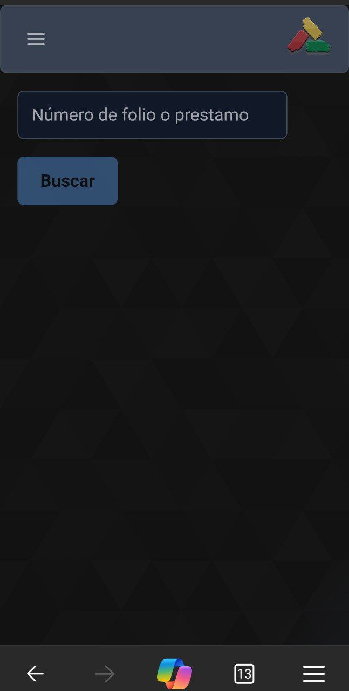

Esta guía explica como ingresar al sistema web mediante las credenciales proporcionadas por el administrador del sistema.

---

## Ingreso al sistema

Ingrese a la página, y oprima el botón `Acceso agentes`:

Imagen de ejemplo

---

Introduzca su usuario y contraseña del sistema, oprima el botón `Acceder`:

Imagen de ejemplo

---

Si los datos de inicio de sesión son correctos, el sistema le mostrará el menú principal:

Imagen de ejemplo

---

  <h3>Si tiene problemas de acceso:</h3>
  <ol>
    <li>Verifique que el usuario y contraseñas proporcionados sean correctos</li>
    <li>Verifique con un superior que el usuario este marcado como activo</li>
    <li>Verifique que el usuario esté dado de alta en el sistema correctamente</li>
    <li>Si el error persiste, póngase en contacto con el administrador del sistema</li>
  </ol>

