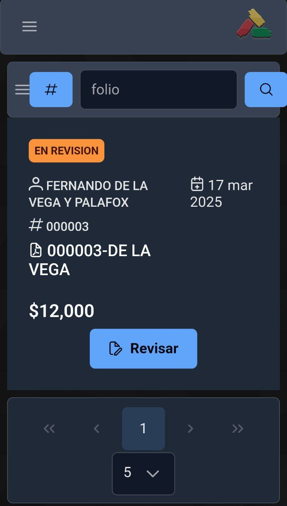

### 1. Inicio de sesión

Ingrese al sistema como se muestra en la sección `Guía rápida - Inicio de sesión`

### 2. Listado de solicitudes

Al ingresar a la pantalla principal del sistema, oprima el botón del menú principal:

Imagen de ejemplo

A continuación, seleccione `Consultas`, y `Listado de solicitudes`:

Imagen de ejemplo

Se desplegará el listado de todas las solicitudes a las que tiene acceso:

Imagen de ejemplo

### 3. Opciones de navegación

Para desplazarse entre las solicitudes, dispone de las siguientes opciones:

- Saltar a la primera página de la lista `<<`
- Página anterior `<`
- Siguiente página `>`
- Saltar a la última página de la lista `>>`

Imagen de ejemplo

Puede mostrar más registros por página seleccionando la cantidad disponible en el menú desplegable:

Imagen de ejemplo

### 4. Búsqueda de solicitudes

Existen 2 opciones para buscar una solicitud de préstamo:

- Por nombre de cliente
- Por el número de la solicitud

Por default, la búsqueda está establecida por el nombre del cliente. Para buscar por medio del número de la solicitud de préstamo, oprima el botón de opción de búsqueda:

Imagen de ejemplo

El sistema le mostrará un mensaje que ha cambiado el criterio de búsqueda:

Imagen de ejemplo

Para realizar la búsqueda, capture el criterio de búsqueda (Nombre de cliente o número de solicitud de préstamo) y oprima el botón con el icono de lupa:

Imagen de ejemplo

El sistema desplegará la información que coincida con el criterio de búsqueda:

Imagen de ejemplo

En caso de que no exista información que coincida, se mostrará el siguiente mensaje de error:

Imagen de ejemplo

Verifique que la información sea válida y vuelva a realizar la búsqueda.
