### 1. Inicio de sesión

Ingrese al sistema como se muestra en la sección `Guía rápida - Inicio de sesión`

---

### 2. Menú principal

Al ingresar a la pantalla principal del sistema, oprima el botón del menú principal:

  
Imagen de ejemplo

_Nota: Esta es una captura del panel principal con todas las opciones visibles._

---

### 3. Solicitud de préstamo para clientes

#### Datos del préstamo

En el menú, seleccione la opción `Solicitud de préstamo`:

  
Imagen de ejemplo

  
  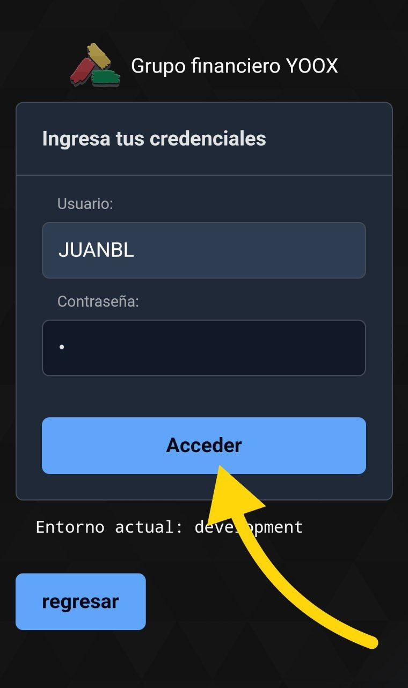

Se abrirá la pantalla de captura de la solicitud de préstamo. La siguiente tabla muestra las restricciones y validaciones para los campos disponibles para captura de los datos del préstamo:

| Campo              | Tipo                     | Restricciones                                    |
| ------------------ | ------------------------ | ------------------------------------------------ |
| Cantidad a prestar | Numérico con 2 decimales | Debe ser mayor o igual a 1000.00                 |
| Plazo              | Menú desplegable         | Debe seleccionar una de las opciones desplegadas |
| Fecha inicial      | Fecha                    | Debe ser mayor o igual a la fecha actual         |

Los siguientes campos son calculados automáticamente por el sistema:

- Pago semanal
- Tasa de interés
- Total a pagar
- Semana de refinanciamiento

---

Una vez capturada la información, seleccione `Siguiente` para continuar con la captura:

  
Imagen de ejemplo

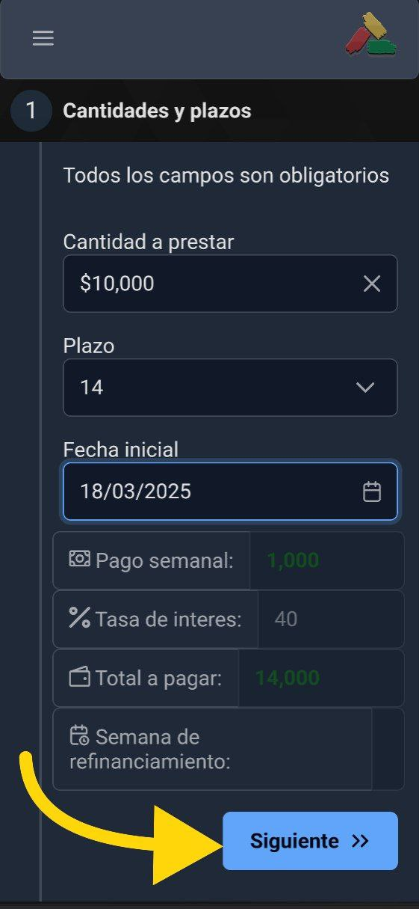

---

#### Datos del cliente

   <strong>¡Importante!</strong> Para el caso de un solicitud de préstamo con un refinanciamiento, los datos del cliente deben provenir de un cliente existente en el sistema que tenga un préstamo que cumpla con los requerimientos obligatorios para refinanciamiento

La siguiente sección corresponde a la captura de los datos del cliente. El sistema permite capturar datos para clientes nuevos o clientes existentes.

La siguiente tabla muestra las restricciones y validaciones para los campos disponibles para captura de los datos del cliente:

| Campo                     | ¿Obligatorio? | Restricciones                                          |
| ------------------------- | ------------- | ------------------------------------------------------ |
| Nombre cliente            | Si            |                                                        |
| Apellido materno          | Si            |                                                        |
| Apellido paterno          | Si            |                                                        |
| Teléfono fijo             | No            | Máximo 10 números. No agregar separaciones ni guiones  |
| Teléfono móvil            | Si            | Máximo 10 números. No agregar separaciones ni guiones. |
| Correo electrónico        | No            | Debe ser un correo electrónico válido                  |
| Ocupación                 | No            |                                                        |
| CURP                      | Si            | Debe ser una CURP válida                               |
| Tipo de calle             | Si            | Debe seleccionar una de las opciones desplegadas       |
| Nombre de la calle        | Si            |                                                        |
| Número Exterior           | Si            |                                                        |
| Número Interior           | No            |                                                        |
| Colonia                   | Si            |                                                        |
| Municipio                 | Si            |                                                        |
| Entidad Federativa        | Si            | Debe seleccionar una de las opciones desplegadas       |
| Código postal             | Si            | Máximo 5 números                                       |
| Referencias del domicilio | No            |                                                        |

##### Clientes existentes

Para buscar un cliente que ya existe en el sistema, active el botón `¿Necesitas buscar un cliente existente?`

  
Imagen de ejemplo

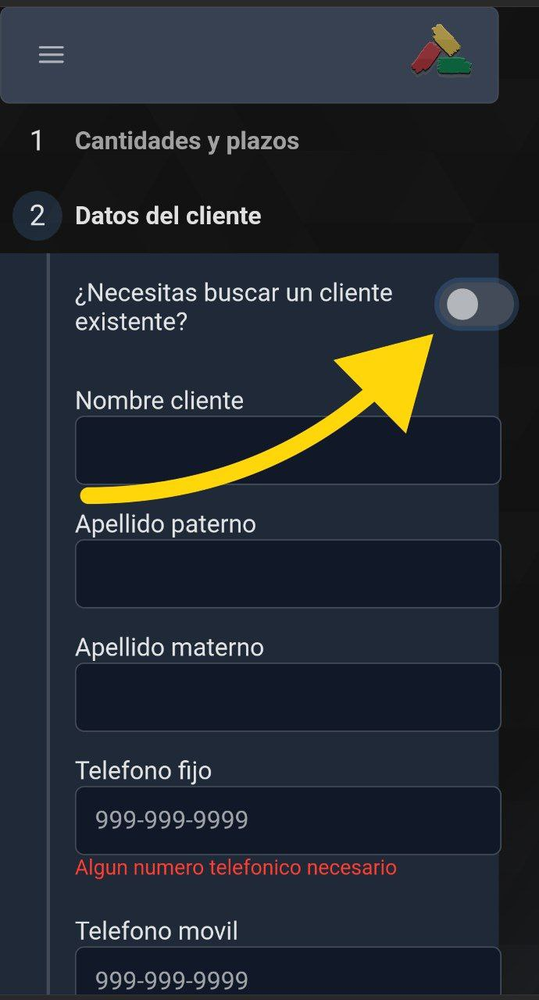

A continuación se desplegará la caja de búsqueda. Las opciones para buscar un cliente son:

- Por medio de Código del cliente
- Por medio de la CURP del cliente
- Por medio del nombre del cliente

Una vez capturado uno de los criterios de búsqueda, seleccione el botón `Buscar`:

  
Imagen de ejemplo

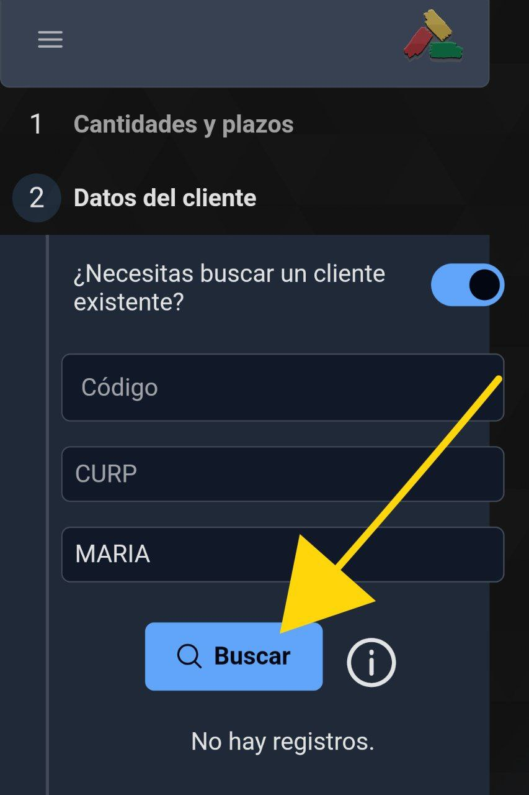

  <h3>¡Importante!</h3>
   <strong>Búsqueda de clientes: </strong> Si introduce 2 o más criterios de búsqueda, se dará prioridad al campo superior, por ejemplo: si introduce código de cliente y nombre, el sistema buscará por medio del código del cliente e ignorará el nombre.

---

Si el sistema encontró 1 o más coincidencias con los criterios de búsqueda de clientes, desplegará una lista de los clientes previamente registrados. Para seleccionar uno, haga click en una fila de la lista:

  
Imagen de ejemplo

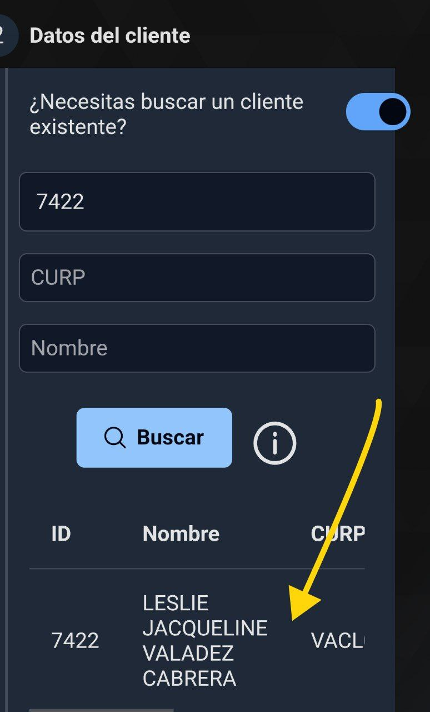

Si el sistema no encuentra alguna coincidencia, redefina los criterios de búsqueda.

#### Búsqueda de préstamo candidato a refinanciamiento

Para verificar si el cliente seleccionado tiene préstamos candidatos a refinanciamiento, abra el menú desplegable dando clic en el área indicada:

  
Imagen de ejemplo

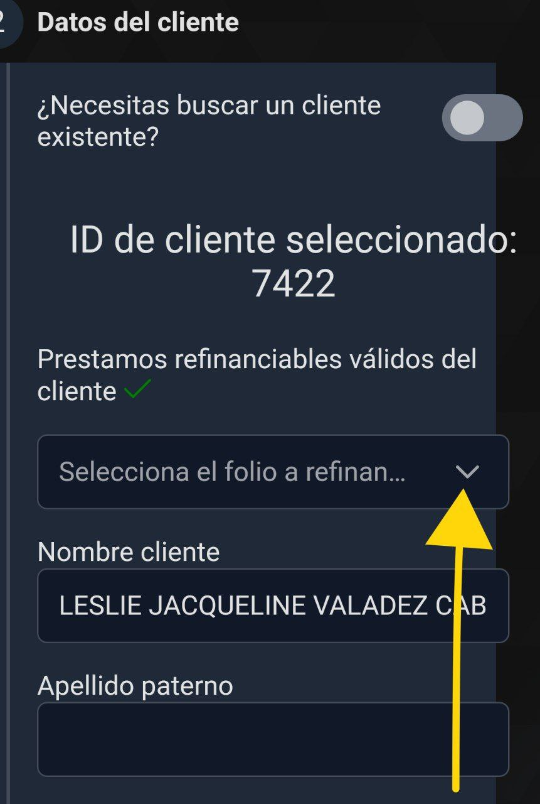

Si algún préstamo actual del cliente es candidato para ser refinanciado, aparecerá en el listado.
Para seleccionarlo, sólo seleccionelo en la lista desplegable:

  
Imagen de ejemplo

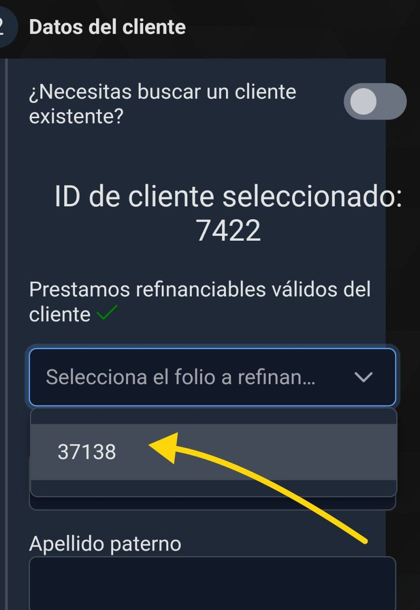

Una vez que haya seleccionado un préstamo actual para ser refinanciado, será redirigido a la sección "1 Cantidades y plazos", donde podrá reajustar la cantidad prestada y podrá ver en los campos inferiores los datos relacionados al refinanciamiento:

  
Imagen de ejemplo

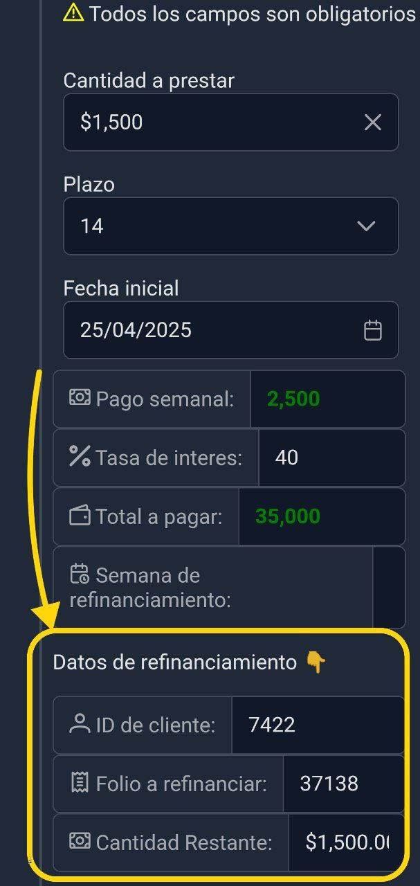

  <h3>¡Importante!</h3>
   <strong>Cantidad a prestar </strong> En el caso de renovación de préstamos por medio de solicitud de préstamo, la cantidad a prestar se ajustará de acuerdo a la cantidad restante del préstamo a refinanciar, si la cantidad restante es menor a 1000.00, la mínima cantidad a refinanciar tendrá que ser mayor o igual a 1000.00; si la cantidad restante es mayor a 1000.00, la cantidad prestada tendrá que ser mayor o igual a la cantidad restante, mas no menor a esta.

  
Imagen de ejemplo

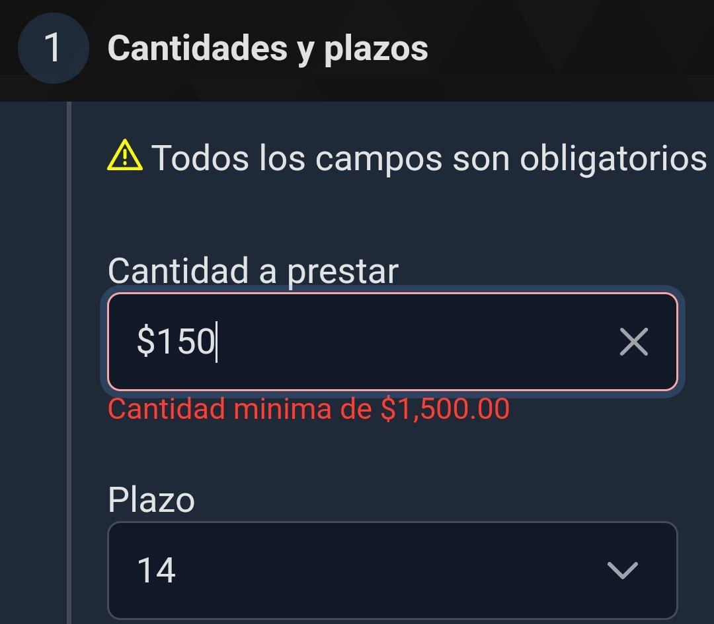

---

#### Datos del aval

La siguiente sección corresponde a la captura de los datos del aval. El sistema realiza las validaciones mostradas en la siguiente tabla:

| Campo                     | ¿Obligatorio? | Restricciones                                          |
| ------------------------- | ------------- | ------------------------------------------------------ |
| Nombre aval               | Si            |                                                        |
| Apellido materno aval     | Si            |                                                        |
| Apellido paterno aval     | Si            |                                                        |
| Teléfono fijo             | No            | Máximo 10 números. No agregar separaciones ni guiones  |
| Teléfono móvil            | Si            | Máximo 10 números. No agregar separaciones ni guiones. |
| Correo electrónico        | No            | Debe ser un correo electrónico válido                  |
| CURP                      | Si            | Debe ser una CURP válida                               |
| Tipo de calle             | Si            | Debe seleccionar una de las opciones desplegadas       |
| Nombre de la calle        | Si            |                                                        |
| Número Exterior           | Si            |                                                        |
| Número Interior           | No            |                                                        |
| Colonia                   | Si            |                                                        |
| Municipio                 | Si            |                                                        |
| Entidad Federativa        | Si            | Debe seleccionar una de las opciones desplegadas       |
| Código postal             | Si            | Máximo 5 números                                       |
| Referencias del domicilio | No            |                                                        |

---

Capture la información correspondiente al aval:

  
Imagen de ejemplo

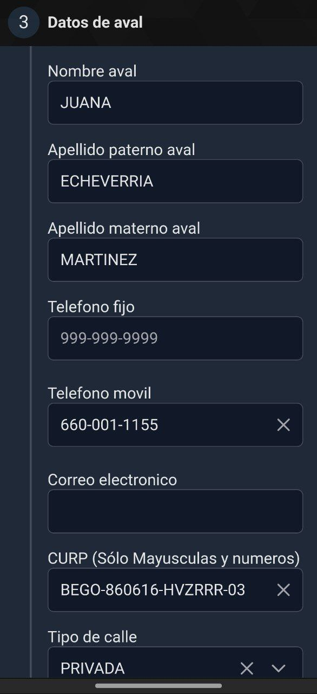

---

Una vez terminada la captura, oprima `Siguiente >>`:

  
Imagen de ejemplo

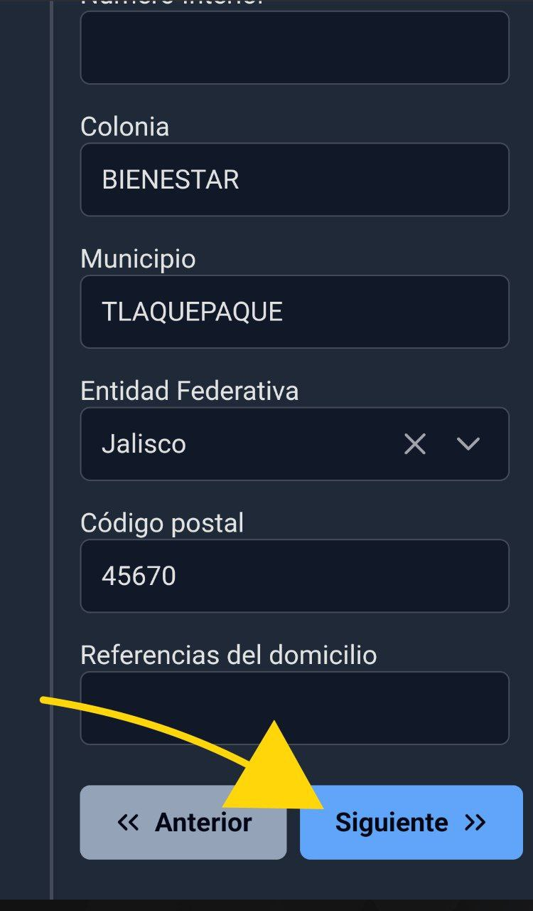

---

#### Documentación

La siguiente sección corresponde a la subida de archivos de la documentación, entre los que se encuentran:

- INE
- Comprobante de domicilio
- CURP
- Otros documentos fiscales

Para subir un archivo, seleccione la opción `+ Agregar`:

  
Imagen de ejemplo

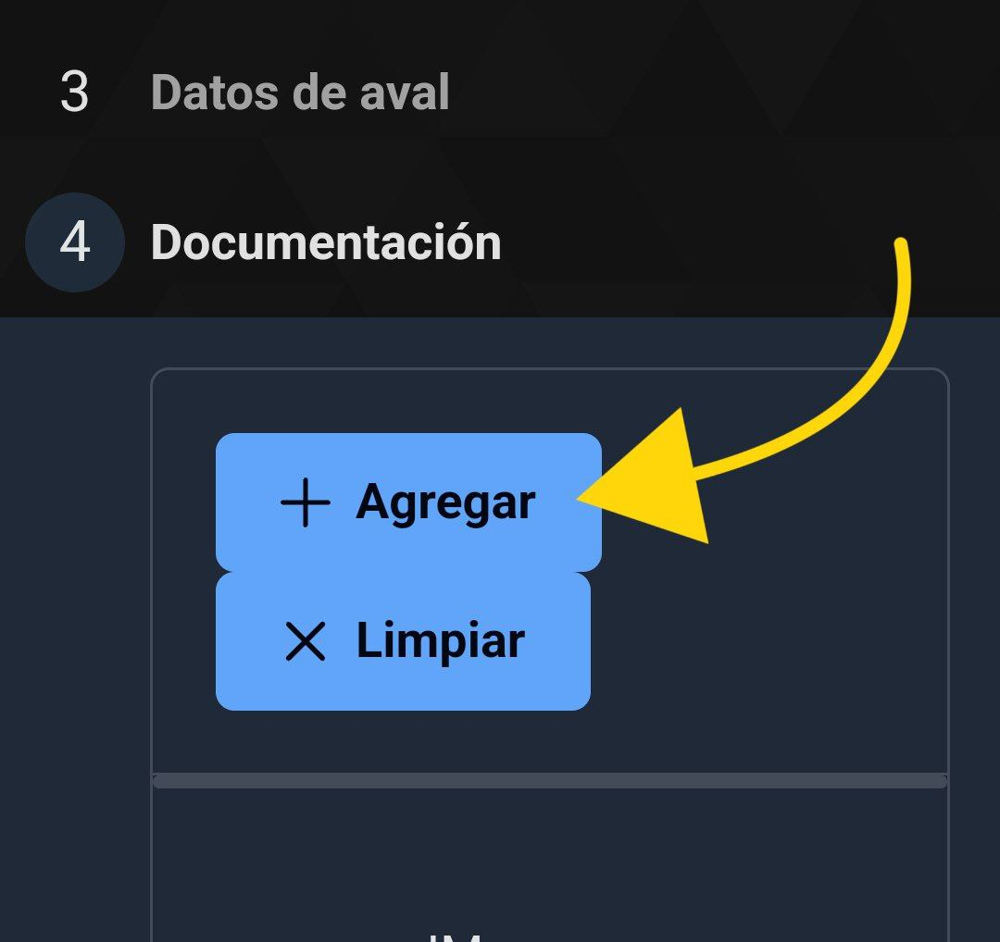

---

Seleccione un archivo de su galeria o carpeta, esta interfaz puede variar dependiento de su dispositivo, versión de sistema operativo móvil o marca del mismo (Android o iPhone):

  
Imagen de ejemplo

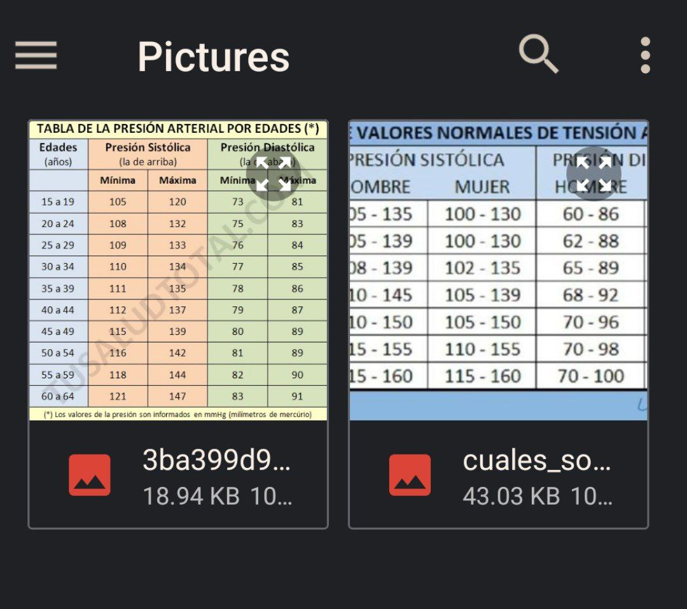

---

Una vez agregado, el archivo seleccionado aparecerá en la lista de archivos agregados. Si necesita agregar otro archivo, seleccione nuevamente la opción `+ Agregar`. Si necesita remover un archivo, seleccione la opción `X` para remover el archivo:

  
Imagen de ejemplo

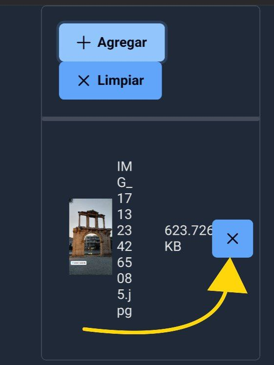

---

#### Observaciones

La última sección le da la opción de capturar alguna observación o comentario general si existiera alguno. Este campo no es obligatorio.

  
Imagen de ejemplo

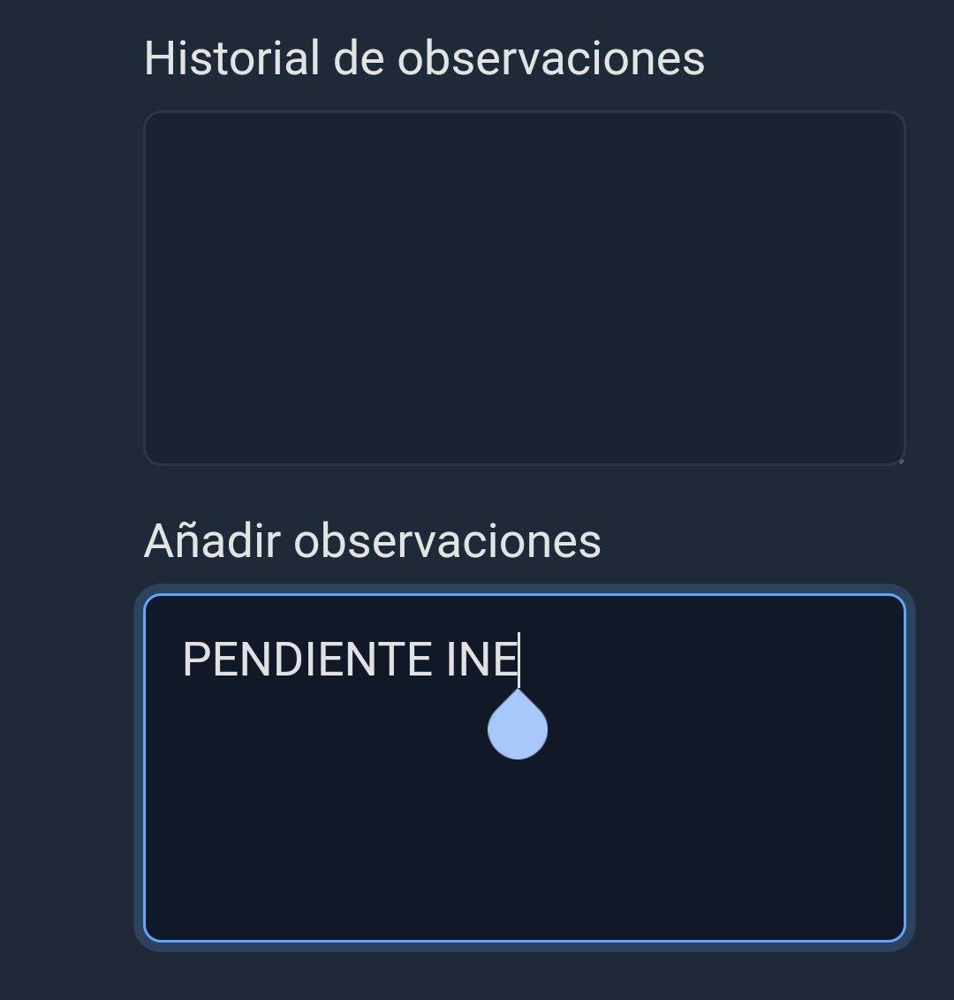

---

#### Envío de la solicitud

Una vez que la información esté completa y la documentación haya sido seleccionada, envíe la solicitud seleccionando la opción `Enviar`.

  <h3>Si tiene problemas de acceso:</h3>
   <strong>¡Importante!</strong> Revise la información capturada, ya que una vez enviada no podrá modificarla a menos que un aprobador la cambie al estatus ACTUALIZAR.

  
Imagen de ejemplo

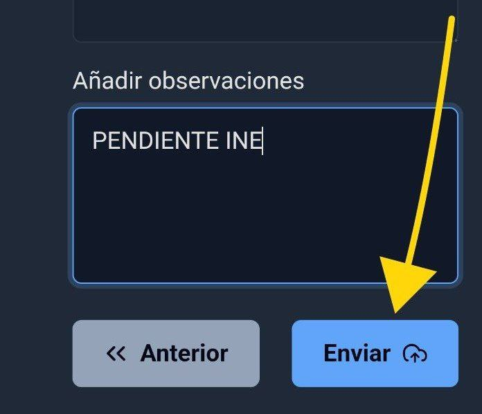

---

Confirme el envío de la solicitud seleccionando `Enviar solicitud`, si necesita rectificar los datos, retroceda seleccionando `Regresar`:

  
Imagen de ejemplo

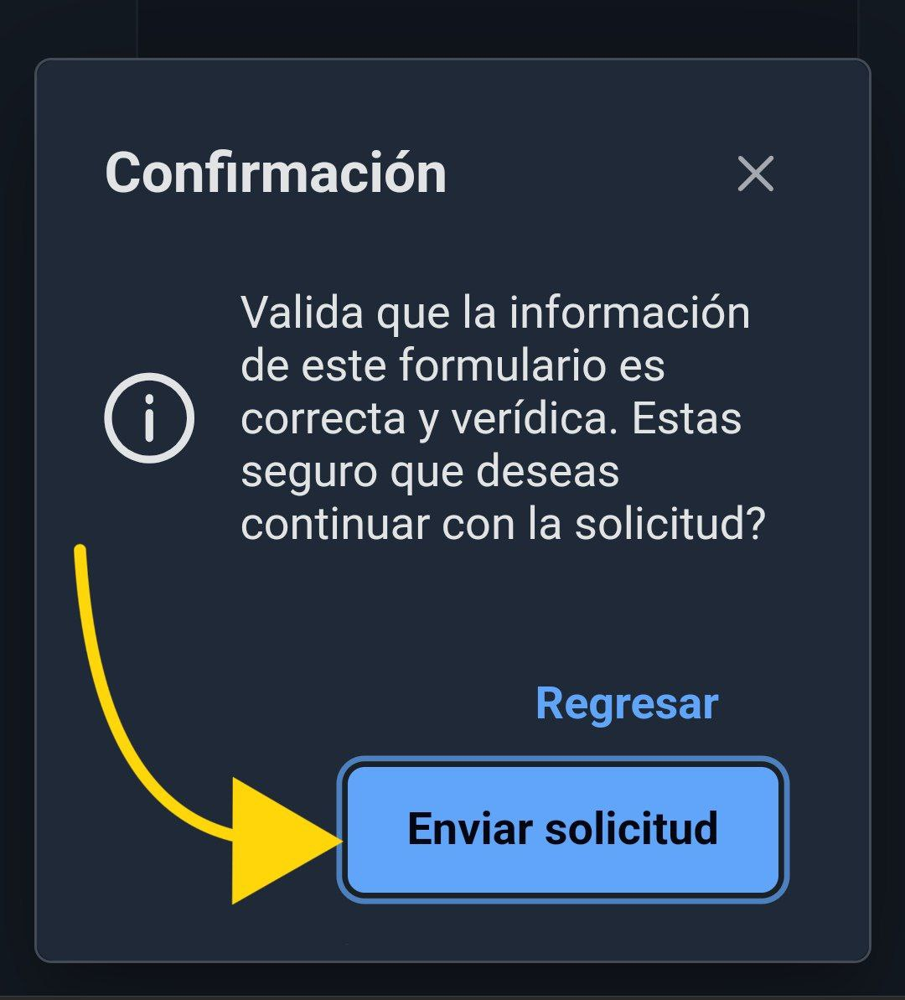

---

Si la información proporcionada es correcta, recibirá la confirmación del sistema:

  
Imagen de ejemplo

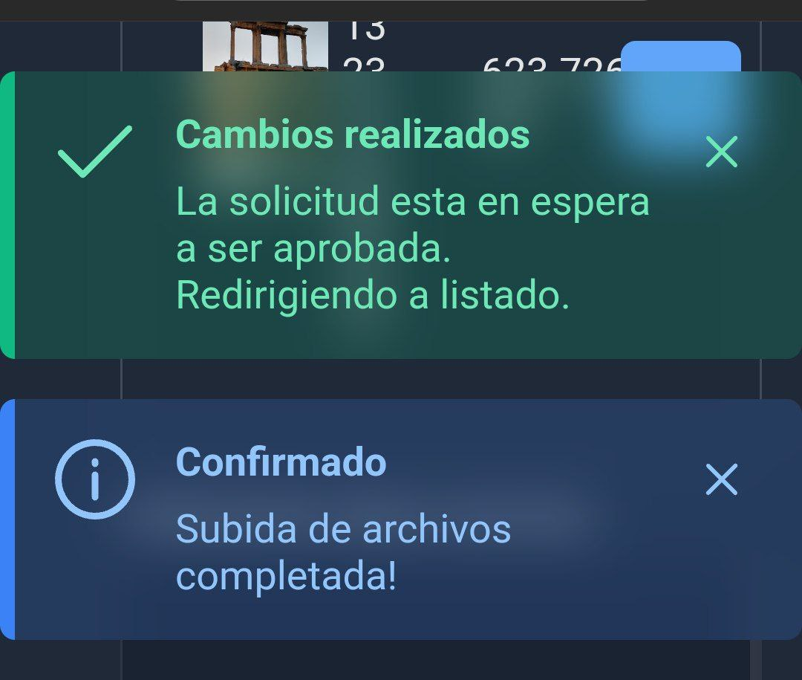

---

Si algún campo contiene información errónea, recibirá un mensaje de error del sistema:

  
Imagen de ejemplo

---

El o los campos con información errónea o faltante serán marcados con mensajes en color rojo:

  
Imagen de ejemplo

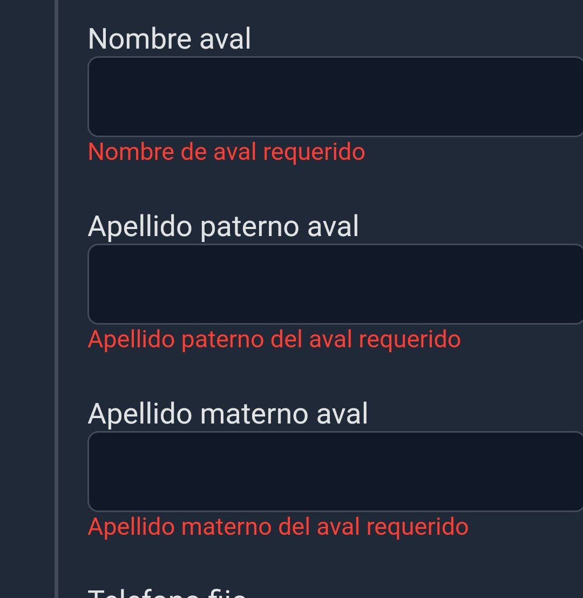

---

En el lista, puede revisar la solicitud generada seleccionando la opción `Revisar`:

  
Imagen de ejemplo

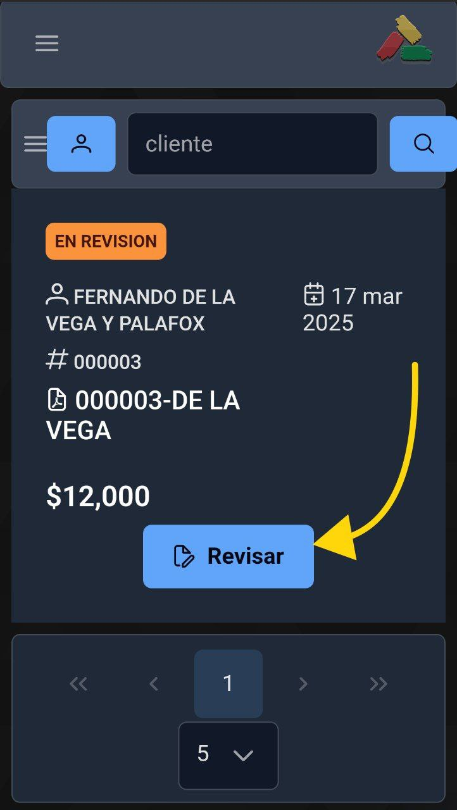

---

En el detalle de la solicitud, podrá consultar el estatus actual de la solicitud:

  
Imagen de ejemplo

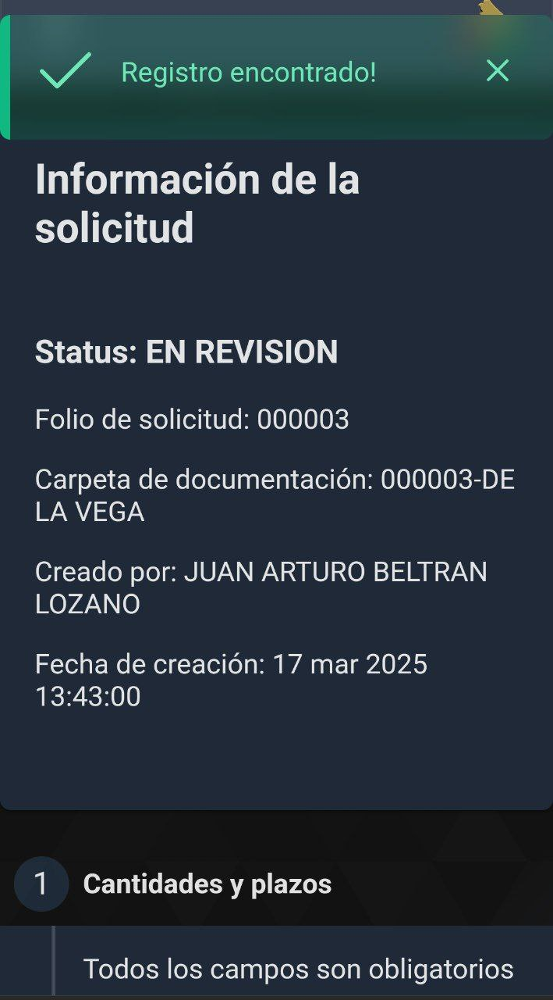

---

---
