# Guía rápida - Captura de una nueva solicitud de préstamo

### 1. Inicio de sesión

Ingrese al sistema como se muestra en la sección `Guía rápida - Inicio de sesión`

---

### 2. Menú principal

Al ingresar a la pantalla principal del sistema, oprima el botón del menú principal:

  
Imagen de ejemplo

_Nota: Esta es una captura del panel principal con todas las opciones visibles._

---

### 3. Solicitud de préstamo para clientes

#### Datos del préstamo

En el menú, seleccione la opción `Solicitud de préstamo`:

  
Imagen de ejemplo

  
  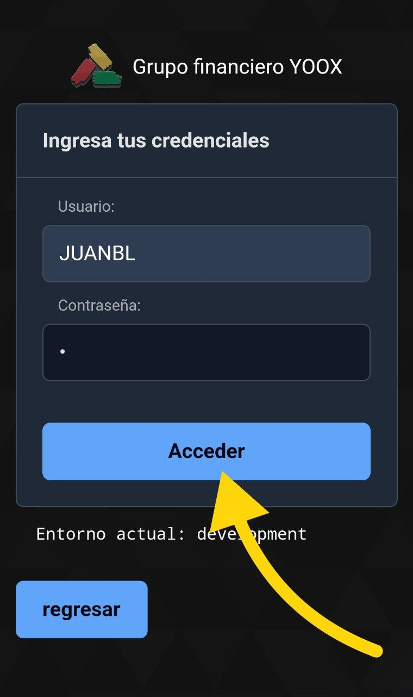

Se abrirá la pantalla de captura de la solicitud de préstamo. La siguiente tabla muestra las restricciones y validaciones para los campos disponibles para captura de los datos del préstamo:

| Campo              | Tipo                     | Restricciones                                    |
| ------------------ | ------------------------ | ------------------------------------------------ |
| Cantidad a prestar | Numérico con 2 decimales | Debe ser mayor o igual a 1000.00                 |
| Plazo              | Menú desplegable         | Debe seleccionar una de las opciones desplegadas |
| Fecha inicial      | Fecha                    | Debe ser mayor o igual a la fecha actual         |

Los siguientes campos son calculados automáticamente por el sistema:

- Pago semanal
- Tasa de interés
- Total a pagar
- Semana de refinanciamiento

---

Una vez capturada la información, seleccione `Siguiente` para continuar con la captura:

  
Imagen de ejemplo

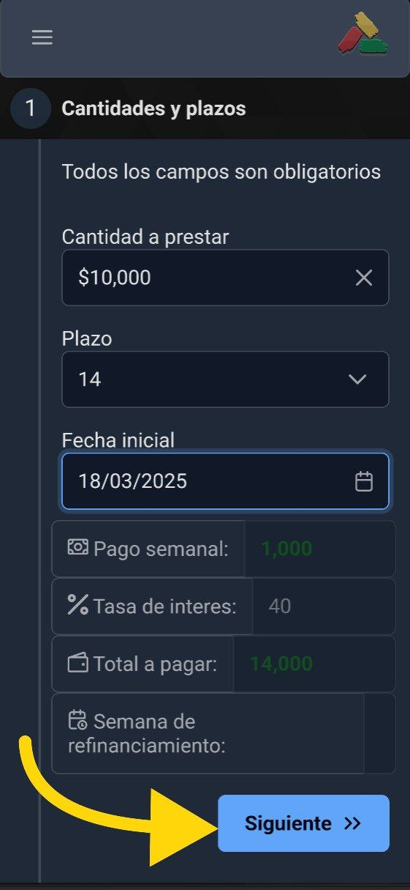

---

#### Datos del cliente

La siguiente sección corresponde a la captura de los datos del cliente. El sistema permite capturar datos para clientes nuevos o clientes existentes.

La siguiente tabla muestra las restricciones y validaciones para los campos disponibles para captura de los datos del cliente:

| Campo                     | ¿Obligatorio? | Restricciones                                          |
| ------------------------- | ------------- | ------------------------------------------------------ |
| Nombre cliente            | Si            |                                                        |
| Apellido materno          | Si            |                                                        |
| Apellido paterno          | Si            |                                                        |
| Teléfono fijo             | No            | Máximo 10 números. No agregar separaciones ni guiones  |
| Teléfono móvil            | Si            | Máximo 10 números. No agregar separaciones ni guiones. |
| Correo electrónico        | No            | Debe ser un correo electrónico válido                  |
| Ocupación                 | No            |                                                        |
| CURP                      | Si            | Debe ser una CURP válida                               |
| Tipo de calle             | Si            | Debe seleccionar una de las opciones desplegadas       |
| Nombre de la calle        | Si            |                                                        |
| Número Exterior           | Si            |                                                        |
| Número Interior           | No            |                                                        |
| Colonia                   | Si            |                                                        |
| Municipio                 | Si            |                                                        |
| Entidad Federativa        | Si            | Debe seleccionar una de las opciones desplegadas       |
| Código postal             | Si            | Máximo 5 números                                       |
| Referencias del domicilio | No            |                                                        |

##### Clientes existentes

Para buscar un cliente que ya existe en el sistema, active el botón `¿Necesitas buscar un cliente existente?`

  
Imagen de ejemplo

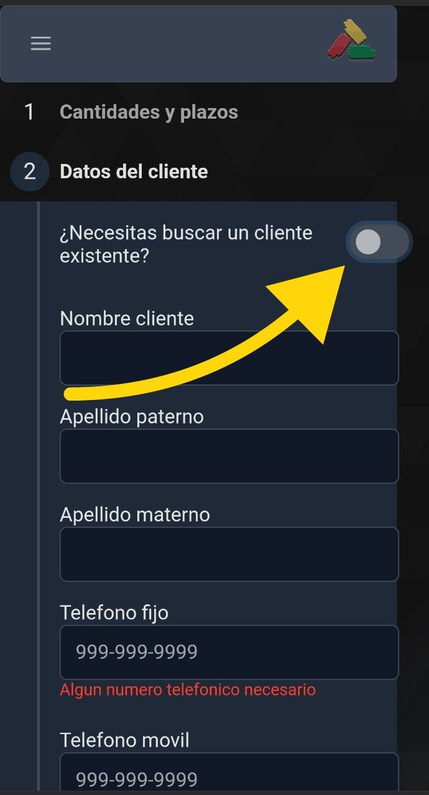

A continuación se desplegará la caja de búsqueda. Las opciones para buscar un cliente son:

- Por medio de Código del cliente
- Por medio de la CURP del cliente
- Por medio del nombre del cliente

Una vez capturado uno de los criterios de búsqueda, seleccione el botón `Buscar`:

  
Imagen de ejemplo

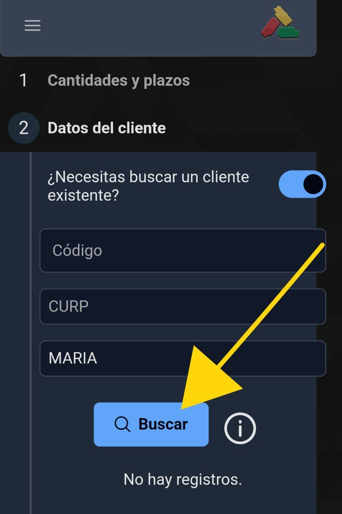

  <h3>Si tiene problemas de acceso:</h3>
   <strong>¡Importante!</strong> Si introduce 2 o más criterios de búsqueda, se dará prioridad al campo superior, por ejemplo: si introduce código de cliente y nombre, el sistema buscará por medio del código del cliente el ignorará el nombre.

---

Si el sistema encontró 1 o más coincidencias con los criterios de búsqueda de clientes, desplegará una lista de los clientes previamente registrados. Para seleccionar uno, haga click en una fila de la lista:

  
Imagen de ejemplo

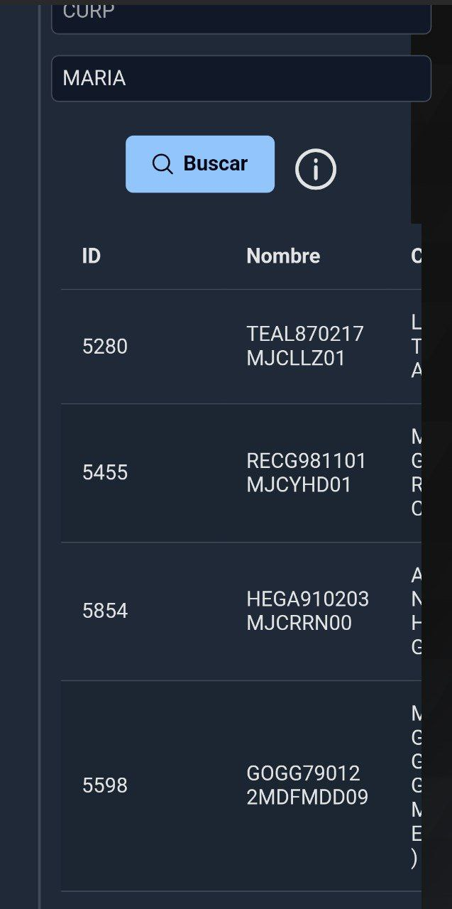

Si el sistema no encuentra alguna coincidencia, redefina los criterios de búsqueda.

---

##### Clientes nuevos

En el caso de los clientes nuevos, omita la búsqueda de cllientes y capture la información directamente en los campos mostrados:

  
Imagen de ejemplo

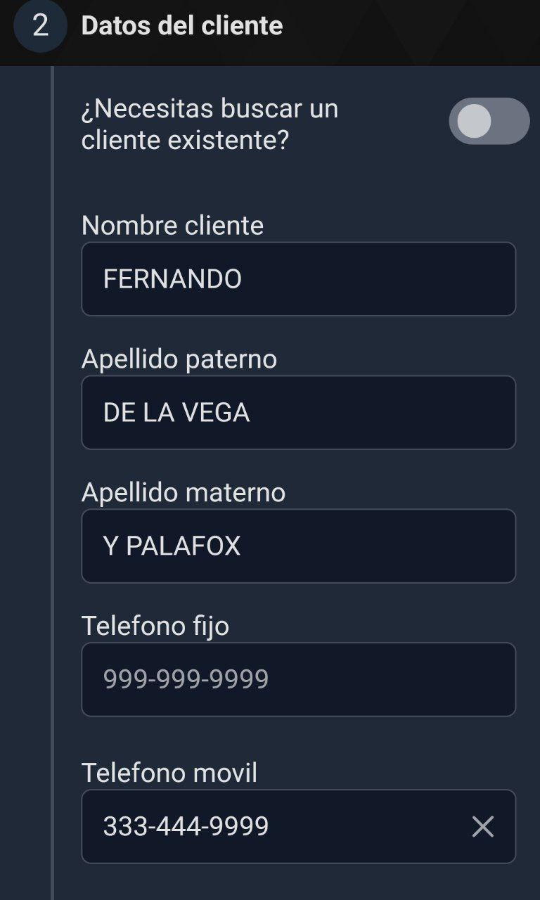

---

Una vez capturada la información del cliente, oprima el botón `Siguiente >>`:

  
Imagen de ejemplo

  
  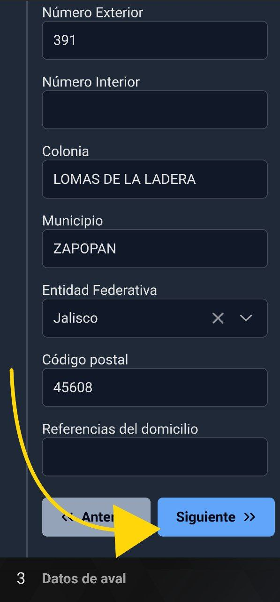

---

#### Datos del aval

La siguiente sección corresponde a la captura de los datos del aval. El sistema realiza las validaciones mostradas en la siguiente tabla:

| Campo                     | ¿Obligatorio? | Restricciones                                          |
| ------------------------- | ------------- | ------------------------------------------------------ |
| Nombre aval               | Si            |                                                        |
| Apellido materno aval     | Si            |                                                        |
| Apellido paterno aval     | Si            |                                                        |
| Teléfono fijo             | No            | Máximo 10 números. No agregar separaciones ni guiones  |
| Teléfono móvil            | Si            | Máximo 10 números. No agregar separaciones ni guiones. |
| Correo electrónico        | No            | Debe ser un correo electrónico válido                  |
| CURP                      | Si            | Debe ser una CURP válida                               |
| Tipo de calle             | Si            | Debe seleccionar una de las opciones desplegadas       |
| Nombre de la calle        | Si            |                                                        |
| Número Exterior           | Si            |                                                        |
| Número Interior           | No            |                                                        |
| Colonia                   | Si            |                                                        |
| Municipio                 | Si            |                                                        |
| Entidad Federativa        | Si            | Debe seleccionar una de las opciones desplegadas       |
| Código postal             | Si            | Máximo 5 números                                       |
| Referencias del domicilio | No            |                                                        |

---

Capture la información correspondiente al aval:

  
Imagen de ejemplo

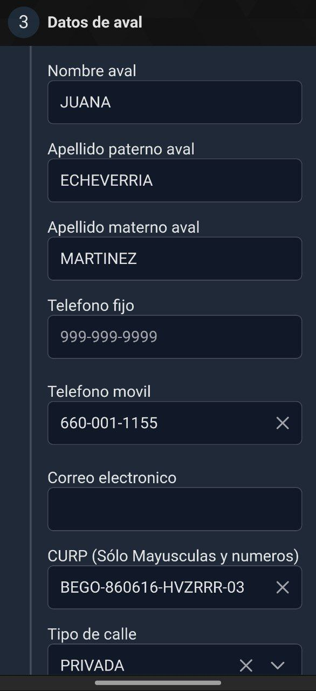

---

Una vez terminada la captura, oprima `Siguiente >>`:

  
Imagen de ejemplo

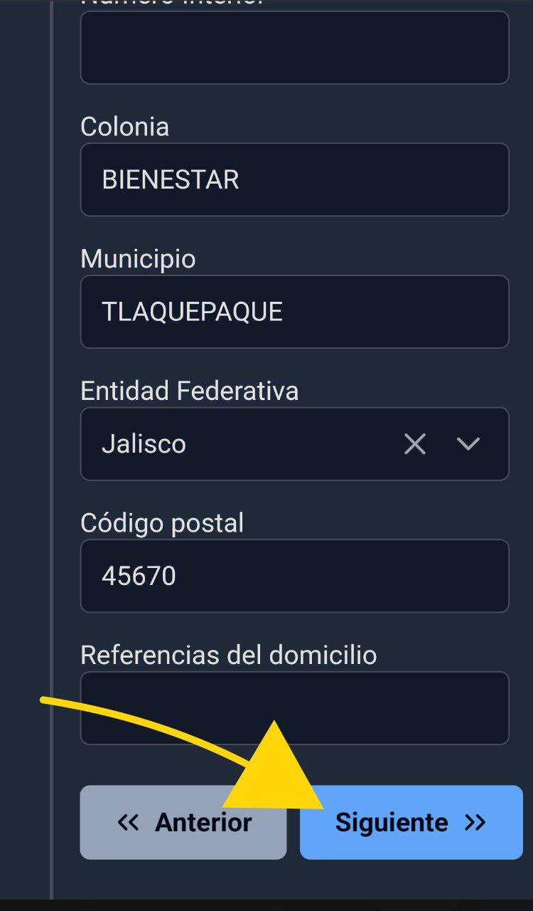

---

#### Documentación

La siguiente sección corresponde a la subida de archivos de la documentación, entre los que se encuentran:

- INE
- Comprobante de domicilio
- CURP
- Otros documentos fiscales

Para subir un archivo, seleccione la opción `+ Agregar`:

  
Imagen de ejemplo

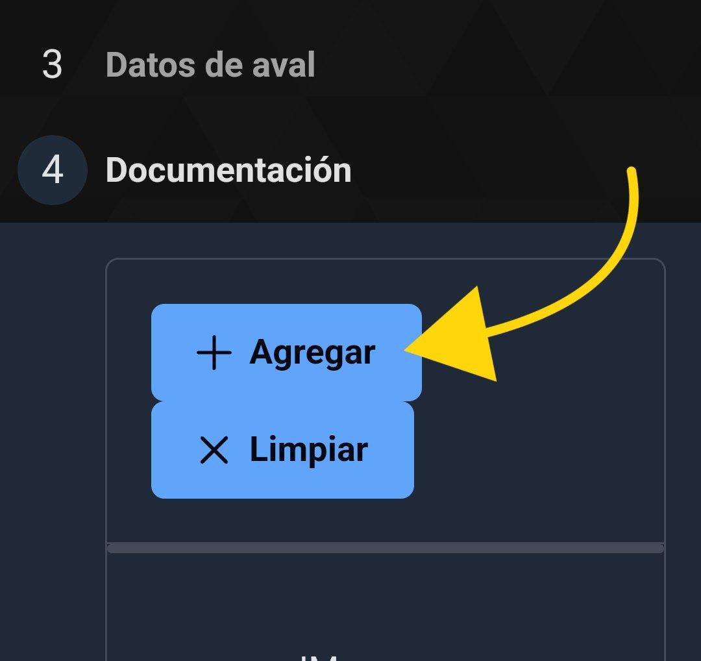

---

Seleccione un archivo de su galeria o carpeta, esta interfaz puede variar dependiento de su dispositivo, versión de sistema operativo móvil o marca del mismo (Android o iPhone):

  
Imagen de ejemplo

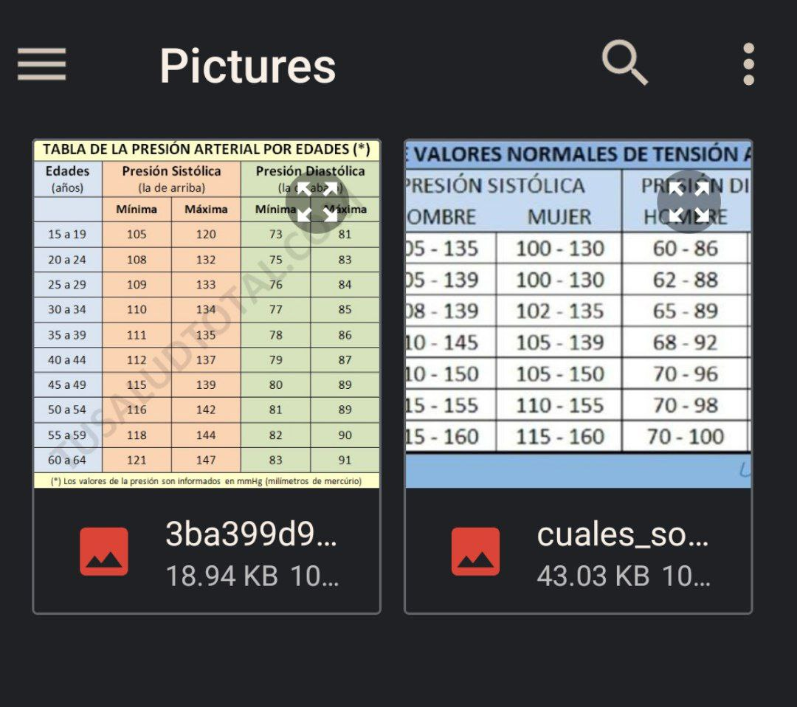

---

Una vez agregado, el archivo seleccionado aparecerá en la lista de archivos agregados. Si necesita agregar otro archivo, seleccione nuevamente la opción `+ Agregar`. Si necesita remover un archivo, seleccione la opción `X` para remover el archivo:

  
Imagen de ejemplo

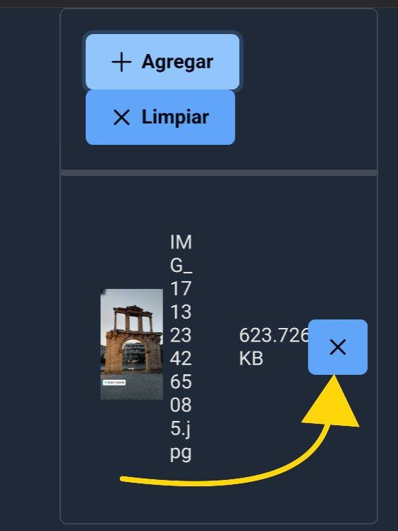

---

#### Observaciones

La última sección le da la opción de capturar alguna observación o comentario general si existiera alguno. Este campo no es obligatorio.

  
Imagen de ejemplo

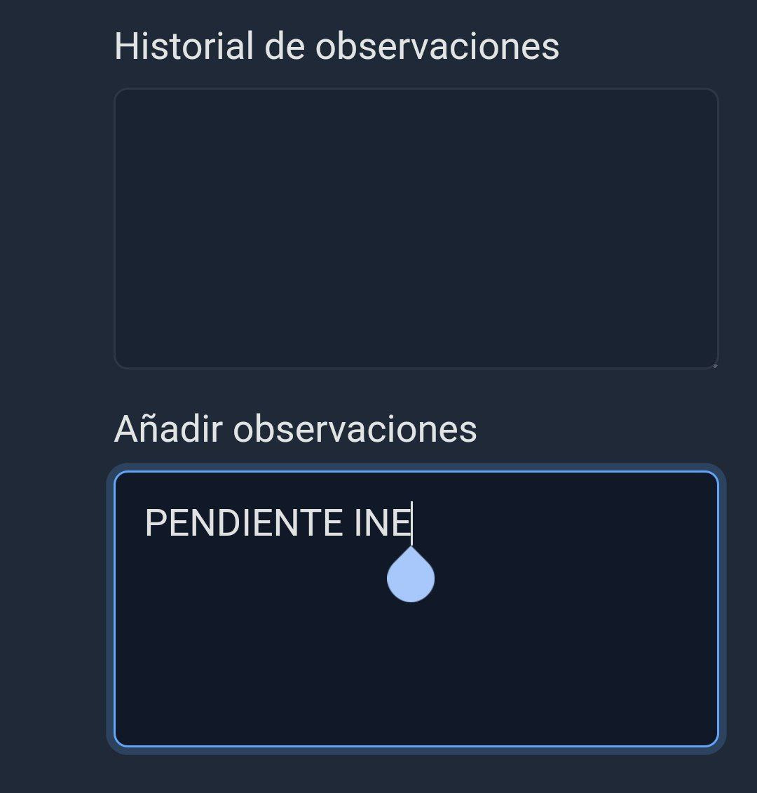

---

#### Envío de la solicitud

Una vez que la información esté completa y la documentación haya sido seleccionada, envíe la solicitud seleccionando la opción `Enviar`.

  <h3>Si tiene problemas de acceso:</h3>
   <strong>¡Importante!</strong> Revise la información capturada, ya que una vez enviada no podrá modificarla a menos que un aprobador la cambie al estatus ACTUALIZAR.

  
Imagen de ejemplo

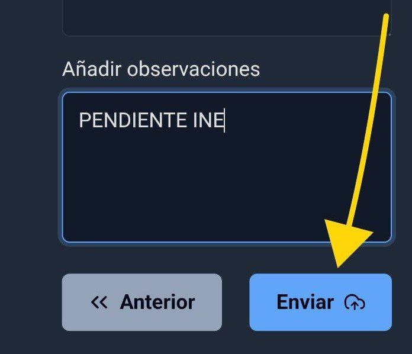

---

Confirme el envío de la solicitud seleccionando `Enviar solicitud`, si necesita rectificar los datos, retroceda seleccionando `Regresar`:

  
Imagen de ejemplo

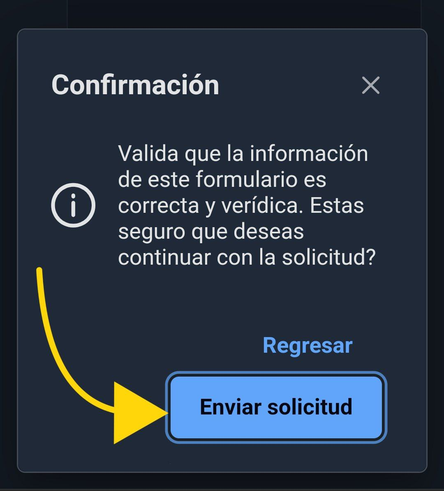

---

Si la información proporcionada es correcta, recibirá la confirmación del sistema:

  
Imagen de ejemplo

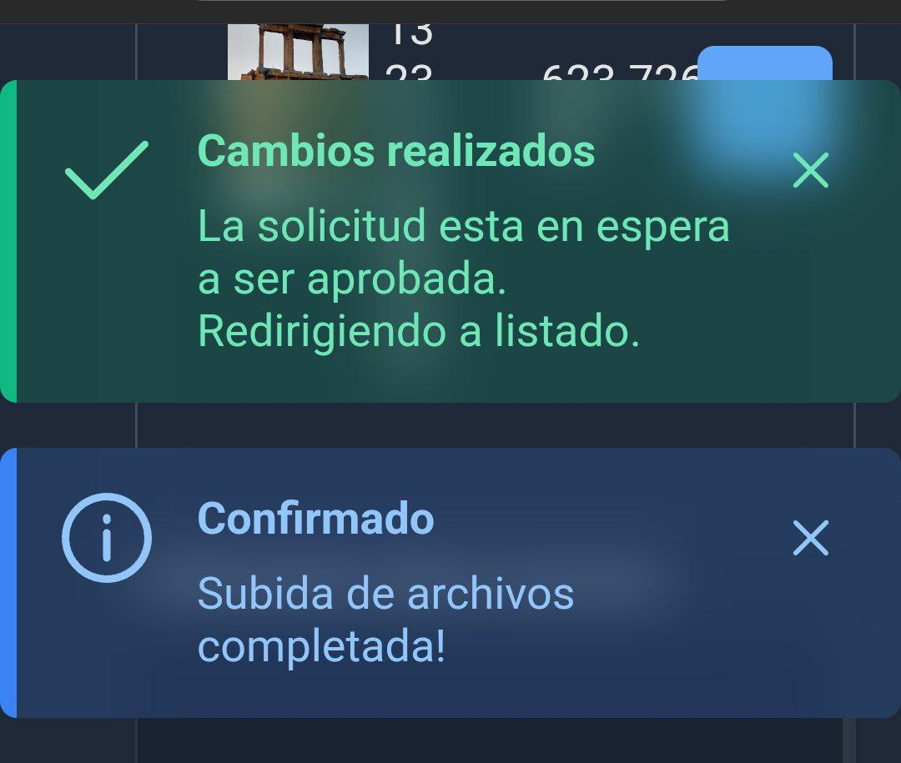

---

Si algún campo contiene información errónea, recibirá un mensaje de error del sistema:

  
Imagen de ejemplo

---

El o los campos con información errónea o faltante serán marcados con mensajes en color rojo:

  
Imagen de ejemplo

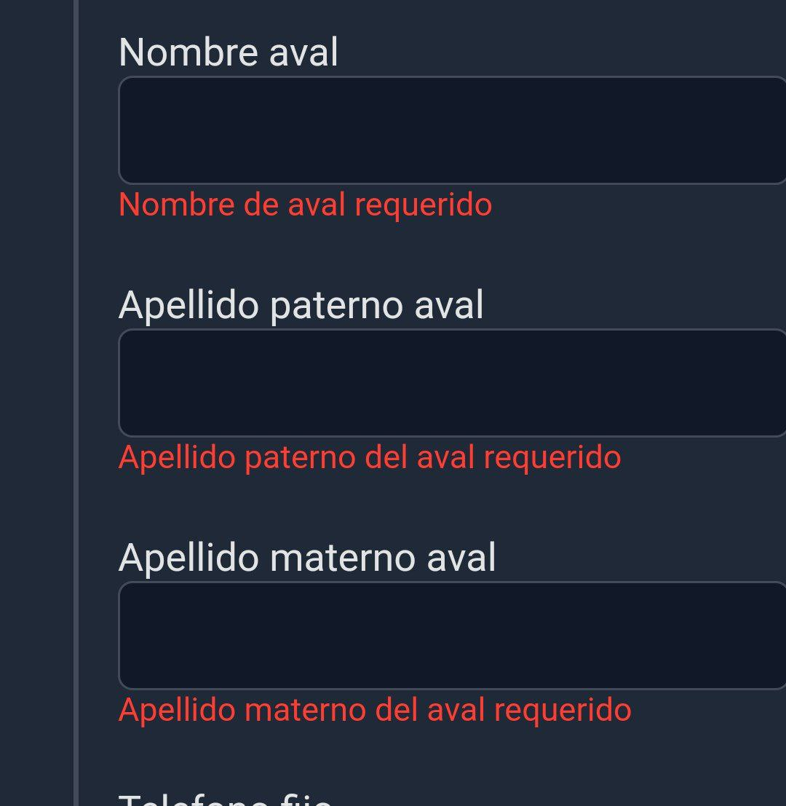

---

En el lista, puede revisar la solicitud generada seleccionando la opción `Revisar`:

  
Imagen de ejemplo

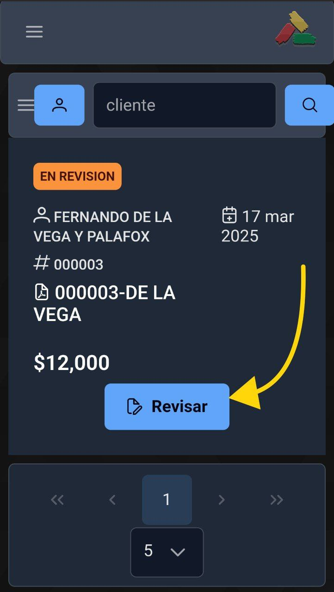

---

En el detalle de la solicitud, podrá consultar el estatus actual de la solicitud:

  
Imagen de ejemplo

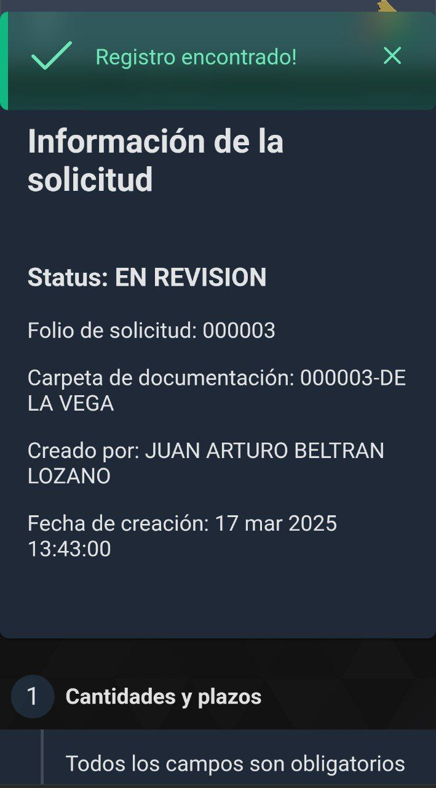

---

---
